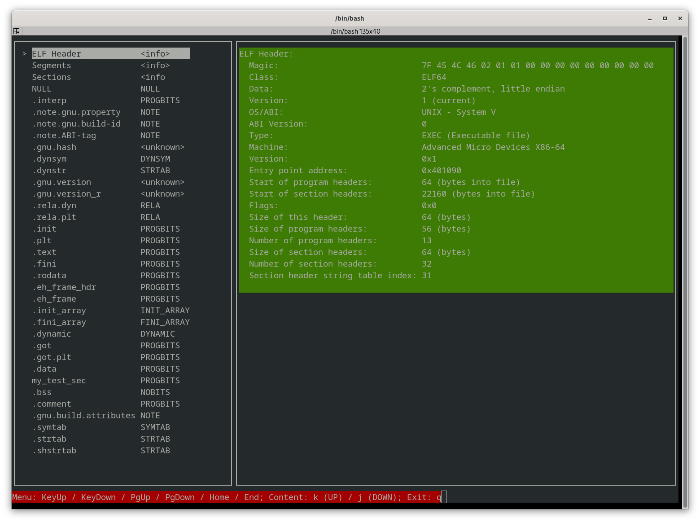
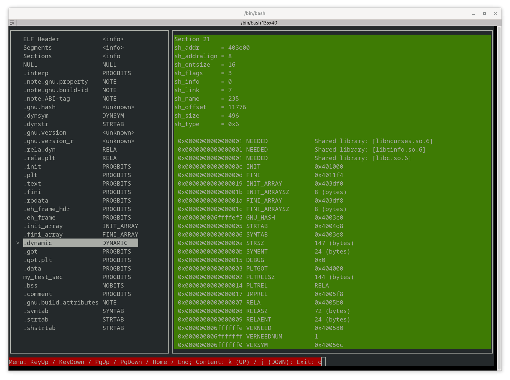

<h1>ELF file viewer (alpha version)</h1>

<b>Requires:</b>
```
libelf
ncurses-devel
```

<b>How to build (example for the `release` preset):</b>
```
cmake --preset release
cmake --build --preset release
```

Note: the following commands print the available presets:
```
cmake --list-presets
cmake --build --list-presets
```

<b>Usage:</b>
```
./elfibia elf-file
```





